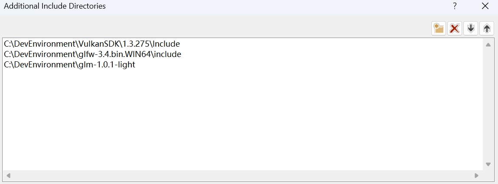
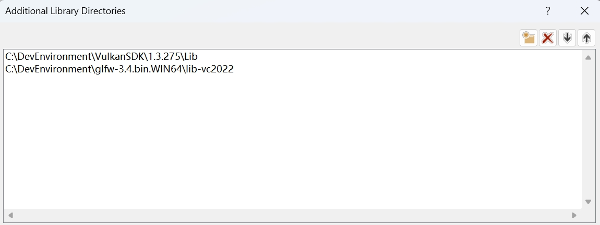

# Hello Vulkan
## Environment
Open project settings
Go to C++ -> General -> Additional Include Directories, add the header directories for Vulkan, GLFW and GLM.

Go to Linker -> General -> Additional Library Directories, add locations of object files for Vulkan and GLFW.

Go to Linker -> Input -> Additional Dependencies, add names of Vulkan and GLFW object files.

